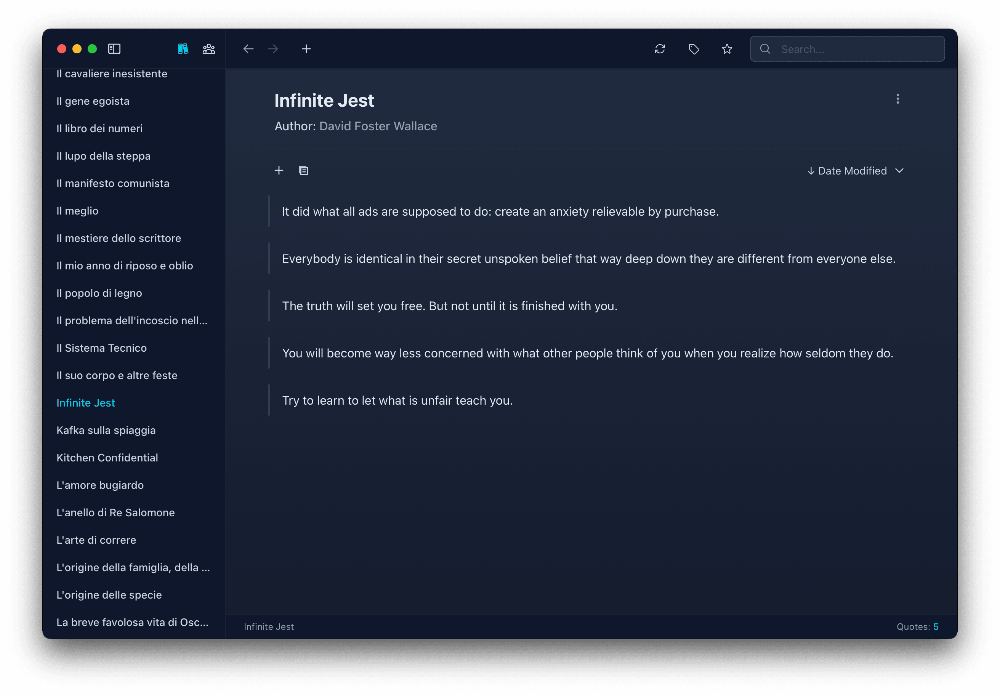

<p align="center">
  <p align="center">
   
  </p>
	<h1 align="center"><b>Liture Quotes</b></h1>
	<p align="center">
		A book highlights manager.
    <br />
    <a href="https://liture.co"><strong>liture.co »</strong></a>
    <br />
    <br />
    <b>Download for </b>
    <a href="https://github.com/eliascotto/liture-quotes/releases/download/1.0.0/Quotes_1.0.0_aarch64_macos.dmg">MacOS</a> ·
		<a href="https://github.com/eliascotto/liture-quotes/releases/download/1.0.0/Quotes_1.0.0_x64-setup_windows.exe">Windows</a> ·
		<a href="https://github.com/eliascotto/liture-quotes/releases/download/1.0.0/Quotes_1.0.0_amd64_linux.deb">Linux</a>
  </p>
</p>


A modern, cross-platform quotes management application built with Tauri and React. Liture helps you organize and manage your favorite quotes from books, with support for importing from popular e-reader platforms.



## Features

- 📚 Import quotes from popular e-reader platforms:
  - Kindle Clippings
  - Kobo SQLite Database
  - iBooks (macOS only)
- 🔍 Powerful search functionality across quotes, books, and authors
- 📝 Add and manage notes for your books
- ⭐ Star and organize your favorite quotes
- 🏷️ Tag system for better organization
- 📖 Chapter management for structured reading
- 💾 Local database for offline access
- 🎨 Modern, responsive UI

## Prerequisites

- Node.js
- Rust
- SQLite
- For macOS/Windows: Tauri CLI
- For Linux: Docker and Docker Compose

## Usage

1. Clone the repository:
```bash
git clone https://github.com/eliascotto/liture.git
cd liture
```

2. Install dependencies:
```bash
npm install
```

## Build

### MacOS / Windows

```bash
npm run tauri build
```

The build output will be stored in `src-tauri/target/release/bundle`.

### Linux

Use Docker for Linux build:

```bash
docker-compose build
docker-compose run --rm tauri-linux-builder
```

If you encounter issues:

```bash
docker-compose up -d tauri-linux-builder
docker ps # grab container id
docker exec -it <container_id> /bin/bash
npm list @tauri-apps/cli-linux-x64-gnu
npm run tauri build
```

## Development

To run the application in development mode:

```bash
npm run tauri dev
```

## Testing

Run the test suite:

```bash
npm test
```

For watch mode:

```bash
npm run test:watch
```

For UI testing:

```bash
npm run test:ui
```

## Contributing

Contributions are welcome! Please feel free to submit a Pull Request.

## License

This project is licensed under the MIT License - see the LICENSE file for details.

## Author

- Elia Scotto - [Website](https://scotto.me)
